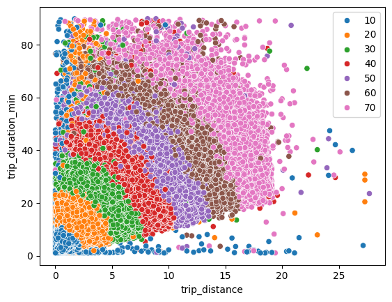
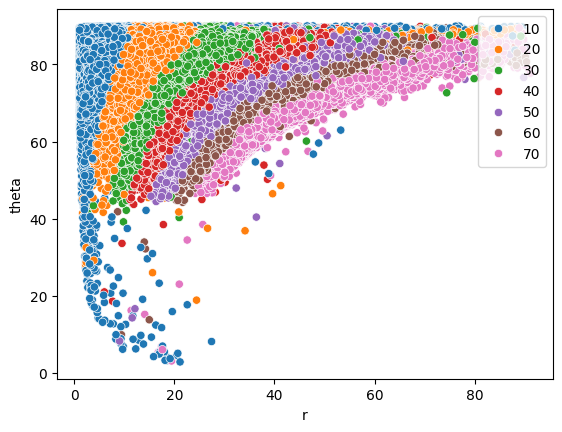
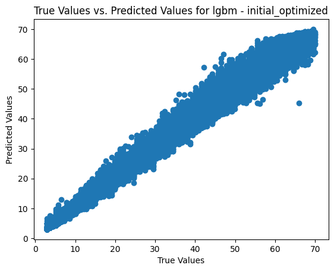

# Project Summary
This document summarizes the project from defining the problem statement to model selection and deployment.
To find more in-depth documentation, please examine the files in the `/docs` folder.

## Abstract
Being able to forecast the fare amount for a NYC yellow taxicab ride was sought as a means to compare to Uber and Lyft. Taxicab rate information and ride data published by New York City was leveraged to obtain the required data to develop machine learning models that predicted fare prices within the success criteria RMSE < $1.00. LightGBM, multi-layer perceptron, Linear SVM, and Linear regression showed the best performance with RMSEs < $0.80 and R-squared scores between 0.995 and 0.996. Hyperparameter optimization was performed on the best models and then were compared against ensembles composed of the tuned best models. It was found that a tuned LightGBM model performed the best by a marginal difference. The LightGBM model was selected for use and deployed using docker and FastAPI to enable API requests as the means of model serving.

## The Problem Statement
People in New York City want to compare how much a ride will cost when examining Uber, Lyft, and hailing a yellow taxicab. A predictive model must be developed to provide an estimated fare amount, the cost before taxes, surcharges, tolls, other fees, and tips are added to the total cost. The users should input the most basic information possible to reduce the effort barrier to use the model. Only fares charged under the standard rate were considered.

### Success Criteria
The model must be able to predict on average the fare amount within $1 of the actual fare amount.

## Domain Knowledge
Information regarding how fare amounts are calculated is available online [here](https://www.nyc.gov/site/tlc/passengers/taxi-fare.page#:~:text=Taxi%20Fare%20*%20$3.00%20initial%20charge.%20*,Westchester%2C%20Rockland%2C%20Dutchess%2C%20Orange%20or%20Putnam%20Counties.).
The information discloses that the fare amount is calculated this way:
* $3.00 initial charge.
* Plus 70 cents per 1/5 mile when traveling above 12mph or per 60 seconds in slow traffic or when the vehicle is stopped.

## Data Engineering
New York City publishes taxicab ride data in parquet files partitioned by year and month.
Data engineering was performed using PySpark and Azure Synapse.
The medallion architecture was employed to develop data layers of the parquet files.
A generic set of data cleaning rules were developed using domain knowledge and statistics to clean the raw data and form the silver layer.
A problem-specific dataset was then curated from the silver layer to form the gold layer.
The data in the gold layer was used to develop the machine learning models.
The data engineering steps are documented in PySpark notebooks found in the `/code` directory.

## EDA & Data Cleaning
Exploratory data analysis showed that there is somewhat of a radial based relationship with trip duration and distance vs price:

Thus, the trip distance and duration were converted to polar coordinates.
The transformation is based on $\theta$ is the angle relative to the trip distance axis.
The radius, <em>r</em>, is defined as :  <em>r</em> = $\sqrt{distance ^2 + duration^2}$

And $\theta$ = $\arcsin(duration / r)$  * (360&deg; / 2 $\pi$ radians)

or $\theta$ = $\arccos(distance / r)$ * (360&deg; / 2 $\pi$ radians)

The resulting plot of r, $\theta$ vs fare amount is:

One observation from the plot is that there appears to be bad data and/or outliers present in the dataset.
The assumption that the dataset is perfectly clean does not hold.
Data cleaning was approached with a conservative philosophy; the goal was to eliminate as little data as possible to avoid cherry-picking data to train and test the model.
The process to cleaning data was as follows:
1. Use domain knowledge to establish hard rules that can eliminate data that clearly violates the rules. This involves average speeds being greater than 65 MPH and fare prices exceeding what the theory tells us the prices should be.
2. Use a combination of domain knowledge and univariate statistics to eliminate some outliers
3. Employ a local outlier factor detection algorithm to remove the remaining outliers which are harder to detect using domain knowledge and univariate statistics. This method is comparable to multivariate outlier detection, but easier to manage how outliers are detected.

The data cleaning resulted in ~1% of the total data being removed.
A total of 7.709 million records remained after the cleaning.

## Initial Experiments
With EDA and data cleaning complete, the next step was to perform a set of basic experiments of fitting machine learning models with default parameters on the clean data.
The dataset was split 80/20 for training and testing datasets for the experiments.

The following combinations of features were used in the experiments to see if a particular set of features performed better than others:
* Trip distance & duration
* Trip distance, duration, r, and $\theta$
* r and $\theta$

The following models were used:
* LightGBM
* CatBoost
* XGBoost
* Stochastic Gradient Descent
* Linear Regression
* Lasso Regression
* Ridge Regression
* ElasticNet Regression
* Linear SVM
* Huber Regression
* Random Forest - Sci-kit Learn
* Random Forest - LightGBM
* DART - LightGBM
* Multi-layer perceptron - Sci-kit Learn

### Results
Model performance was evaluated primarily by the cross-validation and test RMSE.
The MAPE, MAE, and R-squared scores were computed but also correlated with the RMSE.
Additional information regarding models can be found in `/docs/4_initial_experiments.ipynb`

Not all models performed well enough to meet the success criteria of RMSE < $1.00.
Some models were able to have a cross-validation and test RMSE < $1.00, but only the top 4 models were selected.
Several models showed promise with RMSEs less than or equal to $0.80:
* LightGBM - CV and test RMSE of $0.75, R-squared 0.995
* Multi-layer perceptron - test RMSE of $0.75, CV and test R-square scores were 0.995.
* Linear Regression - CV and test RMSE of $0.79, R-squared 0.995
* Linear SVM - CV and test RMSE of $0.80, R-squared 0.995

Note that Ridge regression and Huber regression also had similar performances, but model diversity was sought and thus they were not selected to move forward for model selection.
Additionally, CatBoost had a test RMSE of $0.76 but a CV RMSE of $0.80.
This was a minor difference but concerning that the model may not be the best performed and thus CatBoost was not selected either.

Learning curves verified the models generalized well and avoided overfitting.
It is not a surprise to find the models performing so well since domain knowledge was leveraged to identify how the prices were actually computed.

## Hyperparameter Optimization
Hyperparameter optimization was performed using Optuna on LightGBM, MLP, and Linear SVM.
Additional information regarding models can be found in `/docs/5_initial_experiments_followup.ipynb`

### LightGBM
The best parameters for LightGBM was:
* num_leaves = 163
* min_data_in_leaf = 50
* num_iterations = 450 
* learning_rate = 0.068

The CV and test RMSE were $0.74 and R-square of 0.996.

### MLP
The best parameters for LightGBM was:
* alpha = 0.00073
* hidden_layer_sizes = 80
* learning_rate_init = 0.016

The test RMSE was $0.75 and the CV and test R-square scores were  of 0.996.

### Linear SVM
The best parameters for LightGBM was:
* alpha = 0.00073
* hidden_layer_sizes = 80
* learning_rate_init = 0.016

The CV RMSE was $0.80 and test RMSE was $0.79, with CV and test R-square scores of 0.995.

## Ensemble Testing
Stacking and voting ensembles composed of LightGBM, MLP, Linear SVM, and Linear regression models were evaluated.
The models employed the best parameters found by Optuna.
For the stacking ensemble, LightGBM with default parameters was used as the blending layer.
Both stacking and voting ensembles struggled to outperform LightGBM, with test RMSEs of $0.75.
The R-square scores were both 0.996.
Cross-validation was not performed since the individual models were already evaluated with cross-validation.

## Model Selection & Deployment
Having performed hyperparameter optimization on individual models and evaluating ensembles of the best models, LightGBM was selected as the model to use.
It is worth noting that the best models found meet the success criteria of an RMSE < $1.00 and could be used if desired.
The difference between model performances were about one or two cents, which is a marginal difference at best.
LightGBM was chosen because it is faster and less computationally expensive to train and evaluate and also performed better than other models and the ensembles.
One weakness of LightGBM is poor extrapolation compared to Linear regression, but the volume of data lends confidence that the model would not have to extrapolate very much.

Here is the plot of true values vs. predicted values:

Additional information regarding models can be found in `/docs/5_initial_experiments_followup.ipynb`

The model was deployed using Docker and FastAPI to enable submissions via API requests to get a fare amount prediction, paving the way for app integration.
Details regarding the deployment can be found in the `/code/model_deployment/README.md` file.